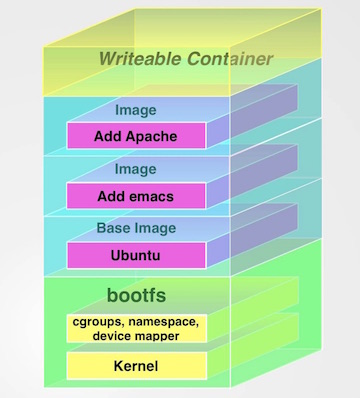

Docker Getting Started!
====================

**Key Concepts**
-------------------------
**Docker is Client-Server**
Docker uses a client-server architecture. The Docker client talks to the Docker daemon, which does the heavy lifting of building, running, and distributing your Docker containers. Both the Docker client and the daemon can run on the same system, or you can connect a Docker client to a remote Docker daemon. The Docker client and daemon communicate via sockets or through a RESTful API.


**Docker Images**
A Docker image is a read-only template. For example, an image could contain an Ubuntu operating system with Apache and your web application installed. Images are used to create Docker containers. Docker provides a simple way to build new images or update existing images, or you can download Docker images that other people have already created. Docker images are the build component of Docker.
**Docker Registries**
Docker registries hold images. These are public or private stores from which you upload or download images. The public Docker registry is provided with the Docker Hub. It serves a huge collection of existing images for your use. These can be images you create yourself or you can use images that others have previously created. Docker registries are the distribution component of Docker.
**Docker Containers**
Docker containers are similar to a directory. A Docker container holds everything that is needed for an application to run. Each container is created from a Docker image. Docker containers can be run, started, stopped, moved, and deleted. Each container is an isolated and secure application platform. Docker containers are the run component of Docker.

**How do I Work with Docker**
You build Docker images that hold your applications.
You create Docker containers from those Docker images to run your applications.
You share those Docker images via Docker Hub or your own registry.

**Things to Keep in Mind**

 - Docker containers are a little different than full-blown VMs. Docker containers by default have no running processes. Without a running process, the container has nothing to do. Part of the process of creating a container is to give it something to do.
	 - So think of the container as a process rather than a vm and you go further. The design goal is to move what was one of many processes on a VM to a container, so running a container is akin to running a process or a service. Those services interact with each other not through inter-process communication but by TCP ports and APIs just like regular services.

 - It is ~~very~~ more difficult (right now at least until Docker supports user mapping more cleanly) to share a volume or folder contents cleanly between host and container without security workarounds (based on my experience) because of the container root:0 setup. This is both good and bad. It is bad because it is convenient to develop with (IMHO). It is good because it maintains the "shared nothing"  design goal of micro-services, in this case dependent / persistent data storage between containers - as well this prevents some security issues.  For more information check out the Docker '-v' option and the '--volumes-from' option - and all the hacks in between. See Reference 1,2,3 at the end of this document for more help.

**Keep in mind the Docker Architecture: Layers**
"*A Docker image is made up of filesystems layered over each other. At the base is a boot filesystem, bootfs, which resembles the typical Linux/ Unix boot filesystem. A Docker user will probably never interact with the boot filesystem. Indeed, when a container has booted, it is moved into memory, and the boot filesystem is unmounted to free up the RAM used by the initrd disk image. When Docker first starts a container, the initial read-write layer is empty. As changes occur, they are applied to this layer; for example, if you want to change a file, then that file will be copied from the read-only layer below into the read-write layer. The read-only version of the file will still exist but is now hidden underneath the copy. This pattern is traditionally called "copy on write" and is one of the features that makes Docker so powerful. Each read-only image layer is read-only; this image never changes. When a container is created, Docker builds from the stack of images and then adds the read-write layer on top. That layer, combined with the knowledge of the image layers below it and some configuration data, form the container. As we discovered in the last chapter, containers can be changed, they have state, and they can be started and stopped. This, and the image-layering framework, allows us to quickly build images and run containers with our applications and services.*"


Turnbull, James (2014-07-12). The Docker Book: Containerization is the new virtualization (Kindle Locations 836-843). James Turnbull. Kindle Edition.


**Docker Installation**
--------------------------------


###Docker Service
Remember Docker is client/server, so in order to use the Docker Service, it needs to be installed and running on a Docker Host.

Please check [docker installation instructions for your platfom](https://docs.docker.com/installation/)

On an rpm distro (Fedora, RHEL, CentOS) after installation...

Check that Docker service is up and running
```console
$ systemctl status docker.service
```
Service returns "active" status if Docker is running
```console
docker.service - Docker Application Container Engine
   Loaded: loaded (/usr/lib/systemd/system/docker.service; disabled)
   Active: active (running) since Fri 2015-09-04 12:50:54 EDT; 6s ago
     Docs: http://docs.docker.com
 Main PID: 13022 (docker)
   CGroup: /system.slice/docker.service
           └─13022 /usr/bin/docker -d --selinux-enabled

```
Service returns "inactive" status if Docker is not running
```console
docker.service - Docker Application Container Engine
   Loaded: loaded (/usr/lib/systemd/system/docker.service; disabled)
   Active: inactive (dead) since Fri 2015-09-04 12:52:48 EDT; 3s ago
     Docs: http://docs.docker.com
  Process: 13022 ExecStart=/usr/bin/docker -d $OPTIONS $DOCKER_STORAGE_OPTIONS $DOCKER_NETWORK_OPTIONS $ADD_REGISTRY $BLOCK_REGISTRY $INSECURE_REGISTRY (code=exited, status=0/SUCCESS)
 Main PID: 13022 (code=exited, status=0/SUCCESS)
```
Start Docker service (Redhat, CentOS, Fedora)
```console
$ sudo systemctl start docker.service
```
Stop Docker service (Redhat, CentOS, Fedora)
```console
$ sudo systemctl stop docker.service
```
Enable Docker service to start automatically (Redhat, CentOS, Fedora)
```console
$ sudo systemctl enable docker.service
```
Disable Docker service to start (Redhat, CentOS, Fedora)
```console
$ sudo systemctl disable docker.service
```
Run docker commands without sudo (otherwise the Docker commands below will require sudo)
```console
$ sudo usermod -aG docker your_username
```


**Docker Commands**
-------------------------------
__Images__
List Docker images on the Docker host. These represent the images that have been pull'ed from a Docker Repository.
```console
$ docker images
REPOSITORY          TAG                 IMAGE ID            CREATED             VIRTUAL SIZE
centos              latest              7322fbe74aa5        11 weeks ago        172.2 MB
hello-world         latest              91c95931e552        4 months ago        910 B
```
To pull a specific image to the Docker host (it is done automatically the first time the run command specifies an image that does not yet exist on the Docker host). To pull the latest fedora image use the 'pull' command and then run the images command.
```console
$ docker pull fedora#(:21) will pull fedora 21 base image
latest: Pulling from docker.io/fedora
48ecf305d2cf: Pull complete
ded7cd95e059: Already exists
docker.io/fedora:latest: The image you are pulling has been verified. Important: image verification is a tech preview feature and should not be relied on to provide security.
Digest: sha256:10ba981a70632d7764c21deae25c6521db6d39730e1dd8caff90719013858a7b
Status: Downloaded newer image for docker.io/fedora:latest
$ docker images
REPOSITORY          TAG                 IMAGE ID            CREATED             VIRTUAL SIZE
centos              latest              7322fbe74aa5        11 weeks ago        172.2 MB
docker.io/fedora    latest              ded7cd95e059        3 months ago        186.5 MB
hello-world         latest              91c95931e552        4 months ago        910 B
```

___!images are used to build containers. containers are build with the run command___

___Containers___

**Launch a new container** called 'centos7_general' from the cents image and open a Bash Shell
```console
$ docker run -i -t --name centos7_demo centos \
/bin/bash
```
translation:

 - Docker was told to run a command - 'run' to run the container as specified
 - -i flag keeps STDIN open from the container even if not attached to it
 - -t flag assign a pseudo-tty to the container
 - --name specifies a name for the container. a hashed ContainerID is generated for this container if you do not specify a name. Note: names are required to be unique
 - 'centos' tells Docker to create a container, in this case the centos container (similar for fedora, debian, ubuntu, etc.) __Note:__ this can be further qualified with a __:__ in the form 'ubuntu:12.04' if you don't want the latest image
	 - these are the stock images provided by Docker Inc. and publicly available on the Docker Hub registry
 - the command also instructed Docker to run the ```/bin/bash``` on the new container

At this point, a centos Docker container should be running and you would end up at a bash shell. You are now logged in as root of the containerized machine.
```console
[root@ef3621c589ee /]# exit
```
An exit will basically stop the container and return to the Docker host command prompt. __This is a big difference from VMs running versus containers running. Once you exit out, the container is unloaded and is not running anymore unless it is a "daemonized container". __

**To start the container**
```console
$ docker start centos7_demo
```
**To attach to the running container**
```console
$ docker attach centos7_demo
```
If the container were not running you would receive this message
```console
You cannot attach to a stopped container, start it first
```
__There are two modes to work in Docker; the interactive mode (shown above) and the daemonized mode. These are known as "interactive containers" and "daemonized containers". __ To start the container as a "daemonized container", you specify a '-d' directive to Docker 'run' command. This makes the containers long-lived and appropriate to run applications and services in most typical scenarios.

Shut down the interactive container first by exiting the container if attached.
```console
[root@ef3621c589ee /]# exit
```
**To stop the container **
```console
$ docker stop centos7_demo
```
**To start the container as a "daemonized container"** specify the '-d' directive to tell Docker to detach the container to the background.
```console
$ docker run --name centos7_demo -d centos /bin/bas
h -c "while true; do echo running; sleep 1; done"
```
__Note:__ the container needs something to do or it just starts and stops. In this case we gave it a shell command to echo a 'running' message to stdout. We can view this output by issuing a logs command
```console
$ docker logs centos7_demo
running
running
running
...
```
To see the output with timestamps we can add the -t flag and the --tail flag to see some portion of the output
```console
$ docker logs -t --tail 3 centos7_demo
2015-09-04T21:32:47.602890698Z running
2015-09-04T21:32:48.603630912Z running
2015-09-04T21:32:56.609339422Z running
```
To see continous log output like a tailf or "tail -f" command
```console
$ docker logs -f centos7_demo
```

**To inspect a container's process** we can use the stats command
```console
$ docker stats centos7_demo
CONTAINER                 CPU %               MEM USAGE/LIMIT     MEM %               NET I/O
centos7_demo   0.00%               0 B/0 B             0.00%               0 B/0 B
```

**To run a process inside a running container** with the exec command
```console
$ docker exec centos7_demo /bin/bash
```

**To look at the containers currently running**
```console
$ docker ps -l
CONTAINER ID        IMAGE                          COMMAND                CREATED             STATUS              PORTS                     NAMES
dd9044eec742        petergdoyle/static_nginx_web   "nginx -g 'daemon of   14 hours ago        Up 3 hours          0.0.0.0:32769->5000/tcp   static_nginx_web    
```

**To run a process inside a running container** with the exec command
```console
$ docker exec centos7_demo /bin/bash
```

**Getting to a shell on the running container:** if the docker container was started using /bin/bash command you can access it using 'attach', if not then you need to execute the command to create a bash instance inside the container using 'exec'.

Always works (but is the only way if /bin/bash not used to start)
```console
$ docker exec -i -t centos7_demo bash
```
Works if container started with /bin/bash
```console
$ docker attach centos7_demo
```

__*It is not recommended to set up an sshd process inside a container__

__List all containers__
```console
$ docker ps -a -q
```
__List all running containers__
```console
$ docker ps -l
```
__List all images__
```console
$ docker images -q
8a0c0129bf79
4099c15bfb1b
7322fbe74aa5
ded7cd95e059
91c95931e552
```
__Delete all containers__

```console
$ docker rm $(docker ps -a -q)
```
__Delete all images__

```console
$ docker rmi $(docker images -q)
```

__Creating Images__
---
There are two ways to create a docker image:

 - Create a container and alter its state by running commands in it; create an image with docker commit
 - Create a Dockerfile and create an image with docker build

Most image authors will find that using a Dockerfile is a much easier way to repeatably create an image. A Dockerfile is made up of instructions, several of which will be discussed in this guide.

**Dockerfile based containers**
Rather than pulling down and image that is either a base image or a pre-prepared image with custom contents, the next step is to customize the images and manage them for specific custom needs.


__Create an NginX Static Web Server Container__
-----------------------
 Create a directory, move into it, and create a file named Dockerfile in that directory and add the followingƒfo
```yaml
# Version: 0.0.2

FROM centos
MAINTAINER Peter Doyle "peter.g.doyle@gmail.com"
RUN yum -y update
RUN yum -y install vim
RUN yum -y install epel-release
RUN yum -y install nginx
EXPOSE 5000
```
Build the docker image using the ./Dockerfile
```console
$ docker build -t="petergdoyle/static_nginx_web"
```

Build the Docker container using the Docker image just created.

 - -d run as daemon container to run detached in the background
 - -p port forwarding required between Docker host and Docker container for the web server. The default for nginx to run on is 80 so that (should be) mapped to another port, in this case 5000 and bound to the 127.0.0.1 interface
 - -h name the host so it is not randomly assigned by the Docker container and you end up with a meaningful name when you attach to the container with a shell
 - --name the container with a meaningful name rather than a randomly assigned name the Docker container assigns if you don't specify one
 - the name of the image to use 'petergdoyle/static_nginx_web
 - the nginx command to launch in the container (as well you must specify that nginx run in the foreground rather than as a background thread

You should be able to see Docker layer the image as each step of the Dockerfile is processed.  Read more about how this works and the Union File System that Docker uses [How does a Docker image work?](https://docs.docker.com/introduction/understanding-docker/). **Take note of the build process as errors need to be fixed or you image will not be useable!**

__GOTCHA__
If you combine commands packages using yum install (RHEL, Fedora, CentOS) or apt-get install, things may not install properly because of Dockers layering system. You should separate the install commands or you may not get the expected results.

__GOTCHA__
If there is any error on the build command, you need to go back and fix it. The built image may not work properly and if you run the ```$ docker images``` command you will see the name you gave the image wasn't applied (in this case "petergdoyle/static_nginx_web"). **AND** the build command doesn't fail! You won't be able to start it and you will have to go and do a ```docker rim <image_name>``` command to get rid of it and find the problem and build it again.

Create a container using the built image (notice the newline for the command for the container to run).
```console
$ docker run -d -p 127.0.0.1:5000:80 -h nginx.dkr --name nginx_web petergdoyle/static_nginx_web \
nginx -g "daemon off;"                                   
```
__GOTCHA__
Containers will immediately stop unless the commands are not running on foreground. Docker requires your command to keep running in the foreground. Otherwise, it thinks that your applications stops and shutdown the container. If there is no command to run, Docker stops the container as there is nothing more to do and it's nature is to run your command as a process for that container. Docker containers rely on the running process inside them to remain active. Applications and Services that normally run in the background daemonize themselves when started which would cause the container to run briefly and then stop when the daemon was forked and launched and the original process that forked it stopped.
Sometimes this container behavior more or less has to be hacked in order to make things work properly. The ```nginx``` command has an option to run in the foreground but others may not.  So one way to get around this is to add ```tail -f /dev/null``` to your command. By doing this, even if your main command runs in the background, your container doesn’t stop because tail is keep running in the foreground. We can use this technique in the apache case.
```console
$ docker run -d apache-server apachectl start && tail -f /dev/null
```

**Obtain a console to the server**
```console
$ docker exec -i -t nginx_web bash
```

**Return low-level information on a container or image**
```console
$ docker inspect nginx_web
[
{
    "Id": "f43c1e9b0344f3c012f691d48ce1e58592ae7737b2d4a12b2a8e4e2cf7be3618",
    "Created": "2015-09-06T02:23:21.35832271Z",
    "Path": "nginx",
    "Args": [
        "-g",
        "daemon off;"
    ],
    "State": {
        "Running": true,
        "Paused": false,
        "Restarting": false,
        "OOMKilled": false,
        "Dead": false,
        "Pid": 8562,
        "ExitCode": 0,
        "Error": "",
        "StartedAt": "2015-09-06T02:23:21.875354948Z",
        "FinishedAt": "0001-01-01T00:00:00Z"
    },
    "Image": "0ee36ddf36b4e924352d30e00340244d6a8a60da5fdd19b0ab9842aef8c07f5b",
    "NetworkSettings": {
        "Bridge": "",
        "EndpointID": "953708fe6848060dab79d9ecafe1771a93a2ee7edd86b21679ff9621ef170fd8",
        "Gateway": "172.17.42.1",
        "GlobalIPv6Address": "",
        "GlobalIPv6PrefixLen": 0,
        "HairpinMode": false,
        "IPAddress": "172.17.0.37",
        "IPPrefixLen": 16,
        "IPv6Gateway": "",
        "LinkLocalIPv6Address": "",
        "LinkLocalIPv6PrefixLen": 0,
        "MacAddress": "02:42:ac:11:00:25",
:
...
```

**Obtain the IP number of the container - specific items from the inspect**
```console
$ docker inspect -f ''{{.NetworkSettings.IPAddress}}'' nginx_web
```

**Sharing folders/volumes between host and container**

Although discouraged in general (Micro-Service "shared-nothing" principal), it is generally useful especially for development to share filesystems between host and container

To share a folder from the current directory (in this case where the Dockerfile is and likely all checked into source control) us the -v option. This example shows that the ```xxx``` directory is to be mapped, mounted and accessible to the container under the ```/xxx``` volume.

```console
$ docker run --rm -ti --name="shared_volume_test" -v $PWD/xxx:/xxx centos:latest /bin/bash
```

**If you are running on an SELinux enabled Docker host** (as I am using CentOS), then you must tell SELinux about this as this is a breach of the SELinux policy for the running Docker Service.  Run following chcon command from the working directory where the Dockerfile is located.  (see Reference 4 below for more details).
```console
$ sudo chcon -Rt svirt_sandbox_file_t $PWD
```

##Inter-Container communication: internal networking

Some things to remember:

 - Every Docker container is assigned an IP address, provided through an interface created when we installed Docker. That interface is called docker0.

 - Every time Docker creates a container, it creates a pair of peer interfaces that are like opposite ends of a pipe (i.e., a packet sent on one will be received on the other). It gives one of the peers to the container to become its eth0 interface and keeps the other peer, with a unique name like vethec6a, out on the host machine. You can think of a veth interface as one end of a virtual network cable. One end is plugged into the docker0 bridge, and the other end is plugged into the container.
	 - By binding every veth* interface to the docker0 bridge, Docker creates a virtual subnet shared between the host machine and every Docker container.


##Docker Machine
Docker Machine provides a simple interface for interacting with a large number of providers through its drivers to create and set up Docker hosts on various servers.

##Docker Swarm
Docker Swarm is native clustering for Docker. It allows you create and access to a pool of Docker hosts using the full suite of Docker tools. Because Docker Swarm serves the standard Docker API, any tool that already communicates with a Docker daemon can use Swarm to transparently scale to multiple hosts.

##Docker Compose
Compose is a tool for defining and running multi-container applications with Docker. With Compose, you define a multi-container application in a single file, then spin your application up in a single command which does everything that needs to be done to get it running.Compose is great for development environments, staging servers, and CI.

__Useful References__
---

 1. [Docker Security: Best Practices for your Vessel and Containers](http://linux-audit.com/docker-security-best-practices-for-your-vessel-and-containers/)
 2. [Why Docker Data Containers are Good](https://medium.com/@ramangupta/why-docker-data-containers-are-good-589b3c6c749e)
 3. [Sharing volumes to Docker as the right user](http://chapeau.freevariable.com/2014/08/docker-uid.html)
 4. [Using Volumes with Docker can Cause Problems with SELinux](http://www.projectatomic.io/blog/2015/06/using-volumes-with-docker-can-cause-problems-with-selinux/)
 5. [Gotchas in Writing Dockerfile](http://kimh.github.io/blog/en/docker/gotchas-in-writing-dockerfile-en/)
 6. [Guidance for Docker Image Authors](http://www.projectatomic.io/docs/docker-image-author-guidance/)
 7. [Dockerfile Best Practices](http://crosbymichael.com/dockerfile-best-practices.html)
 8. [Docker Machine](http://blog.codefresh.io/docker-machine-basics/)
 9. [Orchestrate Containers for Development with Docker Compose](https://blog.codeship.com/orchestrate-containers-for-development-with-docker-compose/)
 10. [Understanding Volumes in Docker](http://container-solutions.com/understanding-volumes-docker/)


__Resources__
--
Turnbull, James (2014-07-12). The Docker Book: Containerization is the new virtualization.  Kindle Edition.

Matthias, Karl; Kane, Sean P. (2015-06-11). Docker: Up and Running. O'Reilly Media. Kindle Edition.


> Written with [StackEdit](https://stackedit.io/).
